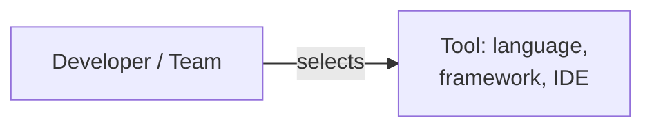

# Authoring DevIQ Articles

This is a Hugo 0.156.0 site. Articles are Markdown files under `content/<section>/<slug>.md`.

## Workflow

1. Read the issue: `gh issue view <N>` (the `gh` CLI is authenticated).
2. Branch off `main`: `feat/<slug>` for new articles, `fix/<thing>` for corrections.
3. Read two or three existing articles **in the same section** before writing. Style is not uniform across the repo — match the section, not the site.
4. Write the article (see Front Matter and Body below).
5. Generate the featured image (see Featured Images — both references are required).
6. Add the article to the section's `_index.md` list.
7. Verify (see Verification). Do not skip this.
8. Commit and open a PR (see Pull Requests).

## Front Matter

```yaml
---
title: "<Title>: <optional subtitle>"
date: YYYY-MM-DD
description: One or two sentences. Used as the meta description.
params:
  image: /<section>/images/<slug>.png
weight: <integer>
---
```

- `draft` is omitted in published articles.
- `weight` is roughly alphabetical within a section, usually multiples of 10. Collisions already exist and are tolerated. To insert between two neighbours, use an intermediate value (e.g. 155 between 150 and 160) rather than renumbering the section. Check first:
  `grep -m1 "^weight:" content/<section>/*.md | sort -t: -k3 -n`

## Featured Images

**Two references are required, and they are not the same path.**

| Where | Path form | What it does |
| --- | --- | --- |
| Front matter `params.image` | absolute: `/laws/images/foo.png` | Feeds the `og:image` meta tag for social previews. **Renders nothing on the page.** |
| Body, first line after front matter | relative: `./images/foo.png` | What readers actually see. |

```markdown
---
title: Example Law
params:
  image: /laws/images/example-law.png
weight: 10
---


Opening paragraph or pull-quote...
```

Setting only `params.image` produces an article with no visible image — this was true of 15 law articles until it was fixed repo-wide. It is **required** in `content/laws/`; elsewhere adoption varies by section, so check the section's peers, and prefer including it for new work.

Image files live in `content/<section>/images/` (Hugo page-bundle resources), **not** in `static/`. The TODO comment in `archetypes/default.md` says `static/` and is misleading — ignore it.

The filename does not have to match the slug. Derive the path from the article's own front matter, never from the slug: `laws-software-architecture.md` correctly points at `laws-of-software-architecture.png`.

### Generating one with ImgForge

Run it via `dnx` so you get the current version. **The globally installed `imgforge` is stale and silently ignores `--bg random`, producing a flat blue background.** `dnx` is not on the Bash PATH — use the PowerShell tool:

```powershell
dnx -y imgforge -- generate --title "Article Title" --bg random --template .imgforge --format blog --out content/<section>/images/<slug>.png
```

Then **look at the generated PNG** with the Read tool before committing it. `--bg random` pulls an arbitrary Unsplash photo; re-run until it is appropriate. Check the background is not accidentally topical in an unfortunate way.

`.imgforge/template.html` supplies the DevIQ watermark. `--format blog` is 1200x630.

## Body

- Match the section's prevailing structure. Common shapes: an italicized pull-quote with attribution, a Table of Contents with anchor links, a `## References` section, and a section relating the topic to sibling DevIQ pages.
- **Verify every internal link resolves to a file that exists** before including it. Do not link to a page you assume exists.
- Code samples are usually C#. Include one only when it genuinely illustrates the point.

### Mermaid

Diagrams render via `layouts/_partials/scripts/mermaid.html`, which loads **Mermaid 11.12.3**.

Use `<br/>` inside quoted labels for line breaks. `\n` does **not** render in Mermaid 11:



Quote any label containing a colon, comma, or parenthesis.

## Section Index

Every section has a `content/<section>/_index.md` with a list to update. Add the entry in the position the list uses — `content/laws/_index.md` is strictly alphabetical by displayed name; `content/architecture/_index.md` has two separate H2 lists (Styles vs Patterns).

Some index entries point at other sections or external URLs, so not every bullet maps to a file in that section. Don't assume.

## Verification

```bash
hugo build                       # must have no ERROR lines
npx markdownlint-cli content/<section>/<slug>.md
```

`hugo build` always emits pre-existing global deprecation warnings (`languageCode`, `.Site.Data`, `.Site.LanguageCode`). These are unrelated to your page — don't try to fix them.

**markdownlint:** there is no repo config, so defaults apply. MD013 (line length) fails pervasively across all existing prose and is accepted — filter it out with `| grep -v MD013`. Fix anything else. MD036 ("emphasis used instead of heading") triggers on an opening pull-quote with no attribution; fix it by appending `— Attribution` to the line.

**Images:** run the bundled checker, which verifies front matter, the in-body reference, the rendered ``, the `og:image` tag, and that the file exists on disk:

```bash
hugo build && python .claude/skills/deviq-article/verify_images.py laws
```

Pass the section you are working on. Only `laws` is currently clean — a repo-wide run reports ~86 articles in other sections with the same latent gap, so an unscoped run will drown your change in pre-existing noise.

Confirm the page actually built: `public/<section>/<slug>/index.html` should exist.

## Line Endings — Important

Most content files are **CRLF**, and several have mixed or doubled endings (`\r\r\n`).

Never bulk-edit content with a text-mode script. Python's default text mode normalizes CRLF to LF on read and writes LF back, rewriting every line of the file. A 2-line change becomes an 800-line diff that no one can review.

For multi-file edits, read and write **bytes**:

```python
raw = open(path, 'rb').read()
# ... operate on bytes, preserving the file's own line-ending bytes ...
open(path, 'wb').write(out)
```

Then confirm the diff is the size you intended before committing: `git diff --stat`.

For single-file edits, the Edit tool is fine.

## Pull Requests

- Commit messages end with the Co-Authored-By trailer; PR descriptions end with the Claude Code attribution line. Follow whatever the session's attribution instructions specify.
- Reference the issue: `Closes #<N>`.
- **Embed the featured image in the PR description.** Binary files show as `+0` additions and GitHub only renders them if the reviewer expands the file in the Files changed tab. Use a raw URL pinned to the commit SHA so it survives later pushes:

  ```markdown
  
  ```

  This repo is public, so raw URLs render.
- Keep PRs scoped. A new article and a repo-wide retrofit belong in separate PRs off `main`.

## Related

- `README.md` — "Creating a New Article", "Creating a Featured Image", "Displaying the Featured Image" (Canva is the alternative to ImgForge).
- `scripts/create-article.ps1` — interactive scaffolder that prompts for category and title.
- `.claude/agents/technical-doc-writer.md` — the agent that drafts articles; it keeps section conventions in `.claude/agent-memory/technical-doc-writer/`.
