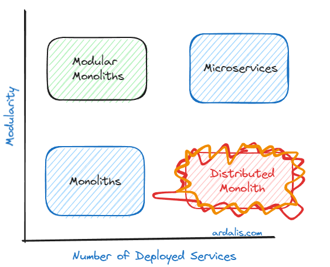
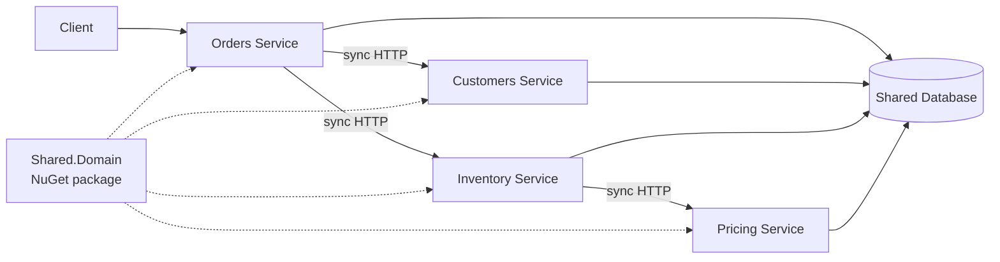

A Distributed Monolith is a system that *looks* like microservices on a deployment diagram but *behaves* like a monolith at runtime and at release time. It is split into many separately deployed services, yet those services are so tightly coupled to one another that they cannot be changed, deployed, scaled, or even kept running independently.

As Steve "ardalis" Smith points out, it is in many ways the worst of all worlds: you take on all of the operational complexity of a distributed system, but you get none of the independence that was supposed to justify that complexity. You still have a monolith - it just happens to communicate over the network instead of through method calls.

## Table of Contents

- [Monoliths, Microservices, and Everything in Between](#monoliths-microservices-and-everything-in-between)
- [How a Distributed Monolith Forms](#how-a-distributed-monolith-forms)
- [Symptoms](#symptoms)
- [Why It Hurts](#why-it-hurts)
- [Avoiding a Distributed Monolith](#avoiding-a-distributed-monolith)
- [Escaping a Distributed Monolith](#escaping-a-distributed-monolith)
- [Related Concepts](#related-concepts)
- [References](#references)

## Monoliths, Microservices, and Everything in Between

Two independent dimensions are often conflated when teams talk about architecture: how *modular* the system is, and how many *deployed services* it consists of. Plotting these against one another produces four broad quadrants.

*Diagram source: [ardalis.com](https://ardalis.com/introducing-modular-monoliths-goldilocks-architecture/)*

- **Monoliths** have low modularity and a single deployment. They are simple to operate but tend to decay into a [Big Ball of Mud](/antipatterns/big-ball-of-mud/) as they grow.
- **[Modular Monoliths](/architecture/modular-monolith/)** have high modularity and a single deployment. Well-defined module boundaries provide most of the organizational benefits of microservices without the costs of distribution.
- **Microservices** have high modularity and many deployments. Each service is autonomous and can be developed, deployed, and scaled independently, at the cost of significant operational complexity.
- **Distributed Monoliths** have low modularity and many deployments. They pay the full price of distribution while delivering none of the benefits of modularity.

The key insight is that adding more deployable units does not, by itself, make a system more modular. Modularity comes from well-designed boundaries, low coupling, and high [cohesion](/terms/cohesion/); deployment topology only determines *where* the code runs. If the boundaries are wrong, splitting the code across processes simply turns in-process coupling into network coupling.

## How a Distributed Monolith Forms

Distributed monoliths are rarely designed on purpose. They are usually the result of one of these paths:

- **Decomposing by technical layer instead of by business capability.** Splitting a system into a "data service," a "business logic service," and a "UI service" guarantees that nearly every feature touches every service.
- **Extracting services before the boundaries are understood.** Early in a project, the domain's [bounded contexts](/domain-driven-design/bounded-context/) are often unclear. Drawing service boundaries at this stage tends to put them in the wrong places, and network boundaries are much harder to move than module boundaries.
- **Breaking up a Big Ball of Mud without first untangling it.** Moving tangled code into separate deployables preserves every dependency it had - now as remote calls.
- **Sharing a database.** When multiple services read and write the same tables, the schema becomes a hidden, unversioned contract between them. No service can change its data model without coordinating with all the others.
- **Chaining synchronous calls.** When fulfilling a single user request requires Service A to call B, which calls C, which calls D, the services are temporally coupled: all of them must be up and responsive at the same time.
- **Sharing domain libraries.** A common "Models" or "Core" package referenced by every service means a change to one entity forces a rebuild and redeploy of all of them.

In this example, each box is deployed separately, but an outage in Pricing breaks order placement, a schema change in the shared database affects every service, and a change to the shared domain package requires all four services to be redeployed together.

## Symptoms

These are some of the common symptoms of a Distributed Monolith:

- **Lockstep deployments.** Releasing a feature requires deploying several services at the same time, often in a specific order, and frequently coordinated in a release meeting.
- **Cascading failures.** When one service slows down or goes offline, many unrelated features fail along with it.
- **Shared data stores.** Multiple services read from and write to the same database tables.
- **Chatty communication.** A single user operation results in many synchronous network calls between services.
- **Cross-team change requests.** Most features require changes in multiple services owned by different teams.
- **Shared domain models.** The same entity classes are referenced across service boundaries through a common library.
- **Integration environments as the only real test.** Services cannot be meaningfully tested in isolation, so confidence only comes from running the whole system together.

If the honest answer to "Can we deploy this service by itself, today, without telling anyone?" is "no," you probably have a distributed monolith.

## Why It Hurts

A distributed monolith combines the drawbacks of both of its neighbours on the chart above:

- **From monoliths:** changes ripple across the system, teams step on one another, and everything must be released together.
- **From microservices:** network latency, partial failures, distributed tracing, service discovery, versioned APIs, container orchestration, and the operational burden of running many deployables.

Each in-process method call that became a network call is now slower and can fail in new ways. Transactions that used to be atomic now span multiple services and require compensating logic. Debugging a single request means correlating logs across several processes. And because the services are still coupled, none of this complexity buys the team independent delivery or independent scaling.

## Avoiding a Distributed Monolith

The surest way to avoid a distributed monolith is to get the boundaries right *before* distributing them.

- **Start with a [Modular Monolith](/architecture/modular-monolith/).** Enforce module boundaries inside a single deployable first. If a module can't be cleanly separated in-process, it won't be cleanly separated over the network either. Extract a module into its own service only when there is a concrete reason, such as independent scaling or a separate team cadence.
- **Draw boundaries around business capabilities.** Use [strategic design](/domain-driven-design/strategic-design/) and [bounded contexts](/domain-driven-design/bounded-context/) to find seams in the domain, and use [context mapping](/domain-driven-design/context-mapping/) to make the relationships between them explicit.
- **Give each service its own data.** A service should own its data store; other services access that data only through the owning service's public API or events.
- **Prefer asynchronous communication.** Publishing [domain events](/design-patterns/domain-events-pattern/) lets services react to changes without requiring their collaborators to be online. See [Event-Driven Architecture](/architecture/event-driven-architecture/).
- **Share contracts, not domain models.** Version integration contracts explicitly and keep each service's internal model private.
- **Align teams with services.** [Conway's Law](/laws/conways-law/) predicts that system structure mirrors organizational structure. If one team owns several tightly coupled services - or several teams must coordinate on every change - the boundaries are likely misplaced.
- **Grow complexity gradually.** [Gall's Law](/laws/galls-law/) observes that complex systems that work evolve from simple systems that worked. Distribution is a form of complexity; add it only when it pays for itself.

## Escaping a Distributed Monolith

If you already have a distributed monolith, there are two broad options, and they are not mutually exclusive:

1. **Consolidate.** Merge tightly coupled services back into a single deployable, ideally organized as a modular monolith. This immediately removes network overhead and coordination costs, and many teams find it is the fastest route to a system they can reason about again.
2. **Decouple.** Redraw service boundaries along business capabilities, split shared databases so that each service owns its data, and replace synchronous call chains with asynchronous messaging. The [Strangler Fig pattern](/design-patterns/strangler-fig-pattern/) and an [Anti-Corruption Layer](/domain-driven-design/anti-corruption-layer/) can help migrate incrementally rather than in a single risky rewrite.

In practice, teams often consolidate first to regain stability and a clear view of the domain, and then extract genuinely independent services later.

## Related Concepts

- [Modular Monolith](/architecture/modular-monolith/) - the recommended alternative that keeps modularity without distribution
- [Big Ball of Mud](/antipatterns/big-ball-of-mud/) - the single-deployment counterpart of this antipattern
- [Bounded Context](/domain-driven-design/bounded-context/) - the primary tool for finding good service boundaries
- [Event-Driven Architecture](/architecture/event-driven-architecture/) - reduces temporal coupling between services
- [Conway's Law](/laws/conways-law/) and [Gall's Law](/laws/galls-law/) - explain how architecture and team structure influence one another and why complexity should grow incrementally

## References

- [Introducing Modular Monoliths: The Goldilocks Architecture](https://ardalis.com/introducing-modular-monoliths-goldilocks-architecture/) - Steve "ardalis" Smith
- [Don't Build a Distributed Monolith](https://www.youtube.com/watch?v=p2GlRToY5HI) - Jonathan "J." Tower, NDC London 2023
- [Modular Monoliths](https://modularmonoliths.com/)
- [Dometrain: From Microservices to Modular Monoliths](https://ardalis.com/DT-Microservices-To-Modular)
