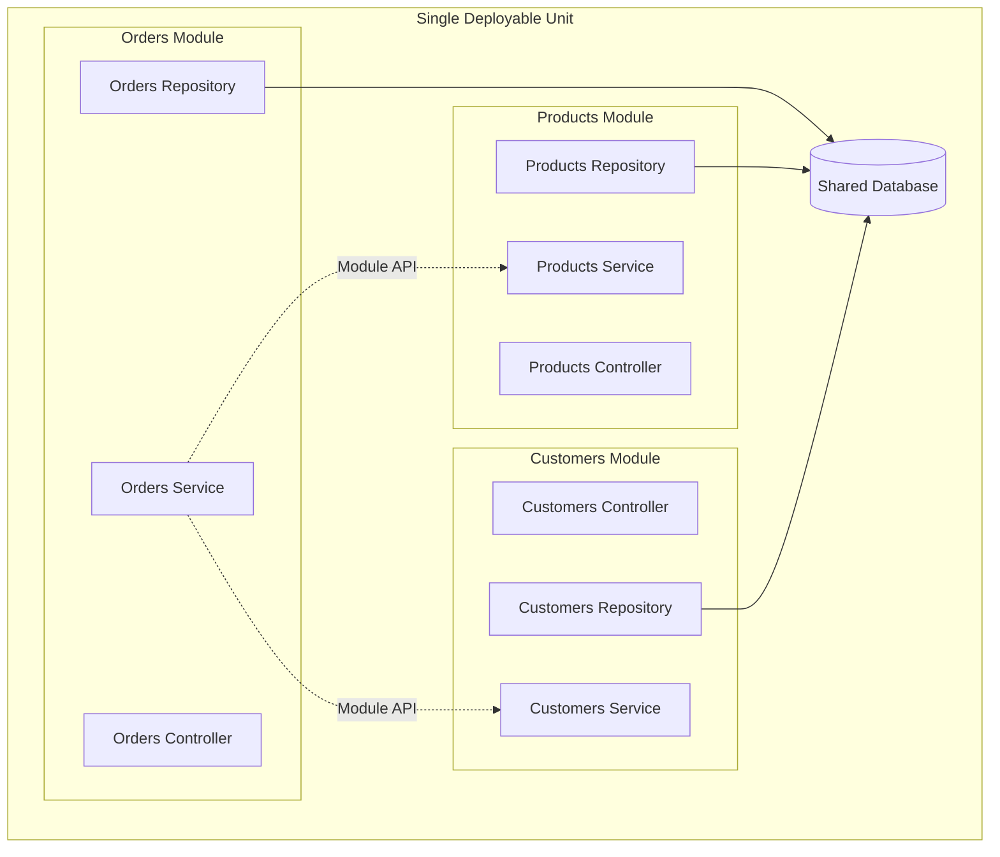

A Modular Monolith is an architectural approach that structures a monolithic application into loosely coupled, highly cohesive modules. Each module encapsulates a specific business capability and has well-defined boundaries, yet the entire application remains a single deployable unit.

This architecture represents a middle ground between traditional monoliths and microservices, offering many of the organizational benefits of distributed systems without the operational complexity.

## How It Works

In a modular monolith, the application is divided into modules based on business domains or [bounded contexts](/domain-driven-design/bounded-context/). Each module:

- Owns its data and business logic
- Exposes a clear public API for other modules to consume
- Hides its internal implementation details
- Communicates with other modules through well-defined interfaces

Modules can communicate through direct method calls, in-process messaging, or [domain events](/design-patterns/domain-events-pattern/). The key is maintaining clear boundaries so modules remain independent and can evolve separately.

## Benefits

A modular monolith offers several advantages:

- **Simpler Operations**: A single deployment unit eliminates the complexity of managing multiple services, networks, and distributed transactions.
- **Easier Development**: Developers can work within a single codebase while maintaining clear ownership boundaries around modules.
- **Better Performance**: In-process communication between modules is faster than network calls in distributed systems.
- **Incremental Migration**: Modules can later be extracted into separate services if needed, providing a path toward microservices.
- **[Separation of Concerns](/principles/separation-of-concerns/)**: Each module focuses on a specific business capability, making the codebase easier to understand and maintain.
- **Testability**: Modules can be tested independently while still allowing integration tests across the entire application.

## Drawbacks

Consider these challenges when adopting a modular monolith:

- **Discipline Required**: Teams must resist the temptation to create tight coupling between modules, which requires ongoing vigilance.
- **Single Deployment**: The entire application must be deployed together, which can be limiting for large teams with independent release cycles.
- **Scaling Constraints**: The application scales as a unit rather than allowing independent scaling of individual modules.
- **Technology Lock-in**: All modules must use compatible technologies and share the same runtime.

## Key Principles

Building an effective modular monolith requires adherence to several principles:

- **[Dependency Inversion](/principles/dependency-inversion-principle/)**: Modules should depend on abstractions rather than concrete implementations.
- **[Single Responsibility](/principles/single-responsibility-principle/)**: Each module should have one reason to change.
- **[Encapsulation](/principles/encapsulation/)**: Modules should hide their internal details and expose only what is necessary.
- **High Cohesion**: Related functionality should be grouped within the same module.
- **[Explicit Dependencies](/principles/explicit-dependencies-principle/)**: Module dependencies should be clear and intentional.

## When to Use

A modular monolith is often a good choice when:

- Starting a new project where the domain boundaries are not yet well understood
- The team is relatively small and can coordinate deployments effectively
- Operational simplicity is valued over independent deployability
- The project needs to evolve quickly without distributed systems complexity
- You want to position the architecture for potential future migration to microservices

For teams experiencing "microservice regret" due to the overhead of managing distributed systems, migrating toward a modular monolith can reduce complexity while preserving modular organization.

## Learn More

For comprehensive guidance on designing and building modular monoliths, visit [modularmonoliths.com](https://modularmonoliths.com/).

## References

- [Modular Monoliths](https://modularmonoliths.com/)
- [Dometrain: Getting Started: Modular Monoliths in .NET](https://ardalis.com/DT-Getting-Started-Modular-Monoliths)
- [Dometrain: Deep Dive: Modular Monoliths in .NET](https://ardalis.com/DT-Deep-Dive-Modular-Monoliths)
- [Dometrain: From Microservices to Modular Monoliths](https://ardalis.com/DT-Microservices-To-Modular)
- [Bounded Contexts](/domain-driven-design/bounded-context/)
- [Domain Events Pattern](/design-patterns/domain-events-pattern/)
- [Separation of Concerns](/principles/separation-of-concerns/)
- [Dependency Inversion Principle](/principles/dependency-inversion-principle/)
- [Single Responsibility Principle](/principles/single-responsibility-principle/)
- [Encapsulation](/principles/encapsulation/)
- [Explicit Dependencies Principle](/principles/explicit-dependencies-principle/)
