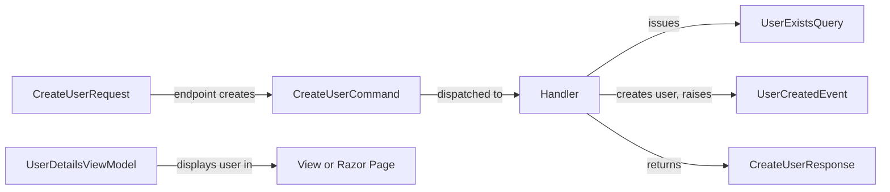

A _Data Transfer Object_ (DTO) is an object whose only job is to carry data from one place to another, such as between a server and a client, or between layers of an application. A DTO is about data, not behavior: it holds values and nothing else, with no business rules, no validation logic, and no instance methods.

## Origin

Martin Fowler described the DTO pattern in _Patterns of Enterprise Application Architecture_ (PoEAA). His motivation was remote calls. Each call to a remote interface is expensive, so it is better to fetch or send all the data you need in a single call than to make many fine-grained calls. A DTO bundles that data into one object that can be serialized, sent across the wire, and deserialized on the other side. The DTO also keeps the remote interface independent of the internal structure of the objects behind it.

Although the original driver was reducing the number of remote calls, the pattern is used today mostly for its decoupling benefits.

## Common Uses

Think of a DTO as a _message_: a package of data sent from one part of a system to another. Model each of the following as a DTO:

- **API requests and responses (API models).** DTOs define the contract of a web API. Clients depend on the DTO shape, not on your internal classes.
- **View models in MVC.** In an [MVC](/design-patterns/mvc-pattern/) application, a view model is a DTO with an intention-revealing name that contains the data a view needs. See [Kinds of Models](/terms/kinds-of-models/).
- **Binding models.** Types used for model binding that accept only the fields a form or request is allowed to submit.
- **Database query results.** Objects that hold the projection returned by a query.
- **Messages.** Commands, events, and queries are simple data containers that are serialized between components or services.
- **Decoupling the domain model from the wire format.** The domain model can evolve (rename properties, restructure entities, add behavior) without breaking clients, as long as the mapping to the DTO is updated.

View models in the [Model-View-ViewModel (MVVM)](/design-patterns/mvvm-pattern/) pattern, such as those used in WPF, are different. They typically contain a lot of behavior, so they are not DTOs.

A single user-creation workflow can involve many DTOs, each with a name that reflects its purpose:



Every box ending in Request, Command, Query, Event, Response, or ViewModel is a DTO. The handler and the view are not.

## DTOs Have No Behavior

By definition, a DTO contains only data. If a type contains logic, it is not a DTO. That logic belongs in the [domain model](/domain-driven-design/domain-model/) or in services.

There is a practical reason as well. A DTO usually exists as a serialized string (JSON, XML) that crosses a process boundary, and only data values transfer, never behavior. The receiver is free to deserialize that data into any type it likes, even a dynamic one. If a property setter enforces that only valid values are accepted, data from an external source that does not follow those constraints can break deserialization. The same is true of a type without a constructor the serializer can use.

A DTO should also be a plain object (a POCO in .NET): no special base classes, no dependencies on frameworks, and no static calls that couple it to behavior. All DTOs are POCOs, but not all POCOs are DTOs. An entity with private setters and methods is a POCO, but it is not a DTO.

## Recommendations

These recommendations reflect the practices most commonly used when designing DTOs in C#.

### Keep Logic and Behavior Out

Do not add instance methods, and do not validate inputs inside the DTO. If it has behavior, it is not a DTO.

### Skip Encapsulation

[Encapsulation](/principles/encapsulation/), which hides logic and protects state behind methods, is the right approach for entities. It is not for DTOs. A DTO has no behavior and no invariants to protect, so it typically has no private or protected members. Make everything public and the type easy to create, read, and write.

### Use Properties, Never Fields

Properties get first-class support across C# and its libraries, and fields often do not. For example, an `OrderDto` with public fields serializes with `System.Text.Json` to an empty object, `{}`, because the serializer ignores fields by default.

```csharp
public class OrderDto
{
  public int Id;             // field: ignored by System.Text.Json by default
  public string OrderNumber = string.Empty;
  public decimal Total;
}

// JsonSerializer.Serialize(new OrderDto { Id = 1, ... }) produces {}
```

Declare `Id`, `OrderNumber`, and `Total` as properties instead and they serialize as expected. Fields are likely to cause serialization problems elsewhere, too.

### Name DTOs for How They Are Used

Use the `Dto` suffix only as a last resort. A name like `PersonDto` or `CustomerDto` is fine for a general representation of a concept (`Dto` and `DTO` casing are both acceptable). When a type has a specific purpose, use a suffix that says so: `ViewModel`, `Request`, `Response`, `QueryResult`, `Command`, or `Event`. Avoid redundant names such as `ViewModelDto` or `RequestDto`.

An endpoint that creates a person should accept a `CreatePersonRequest` with just `FirstName` and `LastName`, not a `PersonDto`. A general-purpose `PersonDto` might later gain a `CreatedDate` that the client should never send because the server generates it, and a purpose-specific request type keeps that property off the inbound contract. This approach also fits the [REPR (Request-Endpoint-Response) pattern](/design-patterns/repr-design-pattern/) for APIs, in which each endpoint has its own request and response types.

### Keep DTOs Pure

Avoid referencing non-DTO or non-primitive types, such as entities, from your DTOs. Doing so pulls in dependencies, makes the DTO harder to secure, and can introduce vulnerabilities. In particular, if you bind an entity (or a DTO that exposes one) directly from external input, an attacker can guess the structure of the entity and its navigation properties and update data outside the intended bounds. This is called _over-posting_. Instead, accept a DTO that contains only the fields a client may change, and update only those specific fields on the entity. Never model-bind an entity from external input and save it.

### Consolidate Mapping

Keep the code that maps between entities and DTOs in one place. See [Mapping and Factories](#mapping-and-factories) below.

### Should DTOs Be Tested?

A DTO with no logic has nothing to unit test. Testing getters and setters adds noise without value. Test the things around DTOs instead: the mapping code that creates them, and serialization round-trips when the wire format is a published contract. If you find yourself wanting to write unit tests for a DTO, it probably contains logic that should live somewhere else.

## Immutability

The classic guidance, from before records existed, is to give a DTO a public parameterless constructor and public getters and setters. That approach is simple and serializes everywhere. Immutability is not a requirement, but it is not forbidden either, and modern C# makes it easy.

A `record` gives you a concise DTO with init-only positional properties and a `ToString` that shows all values, and it round-trips with `System.Text.Json`. A class can also use `init`-only properties.

```csharp
public record CreateUserRequest(string Email, string Password);

public class UserDetailsViewModel
{
  public int Id { get; init; }
  public string Email { get; init; } = string.Empty;
}
```

Immutability is valuable when you _receive_ a message, because you know it cannot change during the method that handles it. When you _build_ an outgoing message, you may not have all the data up front, and public setters can be more convenient than collecting values in locals first. Both are valid, so do what makes sense in your context, choose a style, apply it consistently, and make sure your serializer round-trips it without custom work.

## Validation

Adding DataAnnotations attributes such as `[Required]`, `[EmailAddress]`, or `[MinLength(8)]` to a DTO is perfectly reasonable. They add no behavior to the DTO itself. They describe constraints, and ASP.NET's built-in model validation enforces them. If attributes start to cause pain, for example because rules get complex or depend on context, reconsider them, following [Pain Driven Development](/practices/pain-driven-development/).

One caveat applies to positional records. An attribute placed on a positional record parameter applies to the constructor parameter by default, not to the generated property, unless you use the `property:` target. `Validator.TryValidateObject` inspects properties, so it may not see attributes that were applied only to the parameter. In a .NET 8 demo, a positional record with attributes was not validated by `TryValidateObject` while the equivalent class was. Use the `property:` target, and verify the behavior in your own framework version.

```csharp
public record CreateUserRequest(
  [property: Required, EmailAddress] string Email,
  [property: Required, MinLength(8)] string Password);
```

Another option is [FluentValidation](https://docs.fluentvalidation.net/), which keeps the rules outside the DTO and works the same way for records and classes.

```csharp
public class CreateUserRequestValidator : AbstractValidator<CreateUserRequest>
{
  public CreateUserRequestValidator()
  {
    RuleFor(x => x.Email).NotEmpty().EmailAddress();
    RuleFor(x => x.Password).NotEmpty().MinimumLength(8);
  }
}
```

## Mapping and Factories

You need code that converts between entities and DTOs. Consolidate that mapping in one place rather than scattering it across controllers and services. A common approach is a static factory method on the DTO, conventionally named with a `From` prefix.

```csharp
public class CustomerDto
{
  public string FirstName { get; set; } = string.Empty;
  public string LastName { get; set; } = string.Empty;

  // A static helper kept here for organization. It adds no behavior
  // to a DTO instance, so the DTO is still just data.
  public static CustomerDto FromCustomer(Customer customer)
  {
    return new CustomerDto
    {
      FirstName = customer.FirstName,
      LastName = customer.LastName
    };
  }
}
```

A static factory is not behavior added to the DTO; it is a static method that happens to live next to the type it creates. If you prefer to keep DTOs completely free of references to entities, an extension method in a separate mapping class works too.

Once you have more than a couple of factory methods, consider moving to a mapping library such as AutoMapper to reduce the repetitive code. Explicit factories are simple and easy to debug, and a library pays off as the number of mappings grows. Pick the option whose cost fits your project.

## Example

The following example shows a domain entity, response and request DTOs, and an endpoint that uses them.

```csharp
// Domain entity: has behavior and protects its invariants
public class Product
{
  public int Id { get; private set; }
  public string Name { get; private set; }
  public decimal Price { get; private set; }
  public string? InternalCostCode { get; private set; } // never exposed

  public Product(string name, decimal price)
  {
    Name = name;
    ChangePrice(price);
  }

  public void ChangePrice(decimal price)
  {
    if (price < 0) throw new ArgumentOutOfRangeException(nameof(price));
    Price = price;
  }
}

// Response DTO: data only, with a static factory for mapping
public record ProductResponse(int Id, string Name, decimal Price)
{
  public static ProductResponse FromProduct(Product product) =>
    new(product.Id, product.Name, product.Price);
}

// Request DTO: only the fields a client may submit
public record CreateProductRequest(
  [property: Required] string Name,
  [property: Range(0, double.MaxValue)] decimal Price);

// Endpoint
app.MapPost("/products", async (CreateProductRequest request, IRepository<Product> repo) =>
{
  var product = new Product(request.Name, request.Price);
  await repo.AddAsync(product);
  return Results.Created($"/products/{product.Id}", ProductResponse.FromProduct(product));
});
```

The client never sees `InternalCostCode`, and the entity can change shape without changing the API contract.

## Common Pitfalls

- **Exposing domain entities directly.** Returning entities from an API couples clients to your internal model and risks leaking data. Binding them from requests invites over-posting, and serializing navigation properties can cause cycles.
- **Putting logic in DTOs.** Once a DTO has behavior, it is no longer a DTO, and it becomes a second place where business rules live. If the domain model ends up with no behavior because it all moved elsewhere, you have an [anemic model](/domain-driven-design/anemic-model/).
- **Mapping overhead.** Every DTO needs mapping code, and it must be kept in sync. For simple CRUD apps with trivial models, this can be more ceremony than benefit. Apply [YAGNI](/principles/yagni/) and add DTOs where decoupling is worth the cost.
- **Over-reusing one DTO.** Using the same DTO for create, update, and read operations leads to properties that are required in some cases and meaningless in others. Separate request and response types are cheap and clearer.

## See Also

[Kinds of Models](/terms/kinds-of-models/)

[REPR Design Pattern](/design-patterns/repr-design-pattern/)

[MVC Pattern](/design-patterns/mvc-pattern/)

[MVVM Pattern](/design-patterns/mvvm-pattern/)

[Anemic Model](/domain-driven-design/anemic-model/)

[Encapsulation](/principles/encapsulation/)

[Separation of Concerns](/principles/separation-of-concerns/)

[Persistence Ignorance](/principles/persistence-ignorance/)

[Pain Driven Development](/practices/pain-driven-development/)

## References

- [Weekly Dev Tips: Data Transfer Objects (Part 1)](https://weeklydevtips.com/episodes/008-d2a763a5)
- [Weekly Dev Tips: Data Transfer Objects (Part 2)](https://weeklydevtips.com/episodes/009-cde0c1e7)
- [5 Rules for (better) DTOs (YouTube)](https://www.youtube.com/watch?v=W4n9x_qGpT4)
- [What is the difference between a DTO and a POCO (or POJO)?](https://ardalis.com/dto-or-poco/)
- [Web API DTO Considerations](https://ardalis.com/web-api-dto-considerations/)
- Martin Fowler, [Data Transfer Object](https://martinfowler.com/eaaCatalog/dataTransferObject.html), _Patterns of Enterprise Application Architecture_
