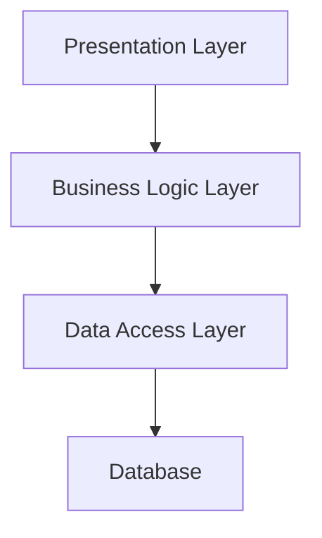

Layered Architecture (also known as N-Layered Architecture) is one of the most common architectural patterns in software development. It organizes a system into a set of horizontal layers, where each layer has a distinct role and responsibility. Layers communicate only with adjacent layers, enforcing separation of concerns and creating a clear structure that is easy to reason about.

The most classic form is the three-tier architecture:

1. **Presentation Layer** – Handles the user interface and user interaction.
2. **Business Logic Layer** – Contains the application's core logic and rules.
3. **Data Access Layer** – Manages data persistence and retrieval.

Additional layers, such as a service layer or an infrastructure layer, are commonly added as applications grow in complexity, giving rise to the more general term *N-Layer Architecture*.

## How It Works

Each layer in a Layered Architecture depends on the layer directly below it, and exposes its functionality upward to the layer above. Dependencies flow in one direction—top to bottom.

A request from the user enters through the Presentation Layer, is processed by the Business Logic Layer, and data is retrieved or stored via the Data Access Layer. The response follows the same path in reverse.

## Benefits

- **Separation of Concerns**: Each layer has a well-defined responsibility, making the codebase easier to understand and navigate.
- **Maintainability**: Changes to one layer are largely isolated from other layers, reducing the risk of unintended side effects.
- **Testability**: Individual layers can be tested in isolation with appropriate mocking or stubbing of adjacent layers.
- **Familiarity**: Layered Architecture is widely understood and easy to onboard new developers onto, as it reflects a natural mental model of how software systems work.
- **Reusability**: Lower layers (such as data access or business logic) can potentially be reused across multiple presentation surfaces (web, mobile, desktop).

## Drawbacks

- **Performance Overhead**: Requests must pass through each layer even when not all layers add value for a particular operation, introducing unnecessary processing.
- **Tight Coupling Between Layers**: Although layers are separated by interface, they are still vertically coupled—a change to the data model may ripple upward through every layer.
- **Anemic Domain Model**: Business logic can become thin and procedural when spread across a service layer and data layer, leading to an [anemic domain model](/docs/domain-driven-design/anemic-model/).
- **Monolithic Tendencies**: Layered architectures often grow into large, tightly-coupled monoliths over time, making them harder to scale or evolve.
- **Scalability Challenges**: Scaling a single layer independently is difficult because layers share the same deployment unit in many implementations.

## Variations

- **Strict Layering**: A layer may only communicate with the layer immediately below it.
- **Relaxed Layering**: A layer may communicate with any lower layer, skipping intermediate layers for performance or convenience.

## Related Topics

- [N-Tier Architecture](/docs/architecture/n-tier-architecture/) – A related architectural style that focuses on physical deployment tiers rather than logical layers.
- [Vertical Slice Architecture](/docs/architecture/vertical-slice-architecture/) – An alternative approach that organizes code by feature rather than by layer.
- [Clean Architecture](/docs/architecture/clean-architecture/) – A layering approach that keeps business rules at the center and infrastructure at the edges.

## References

- Richards, Mark, and Neal Ford. *Fundamentals of Software Architecture: An Engineering Approach*. O'Reilly Media, 2020.
