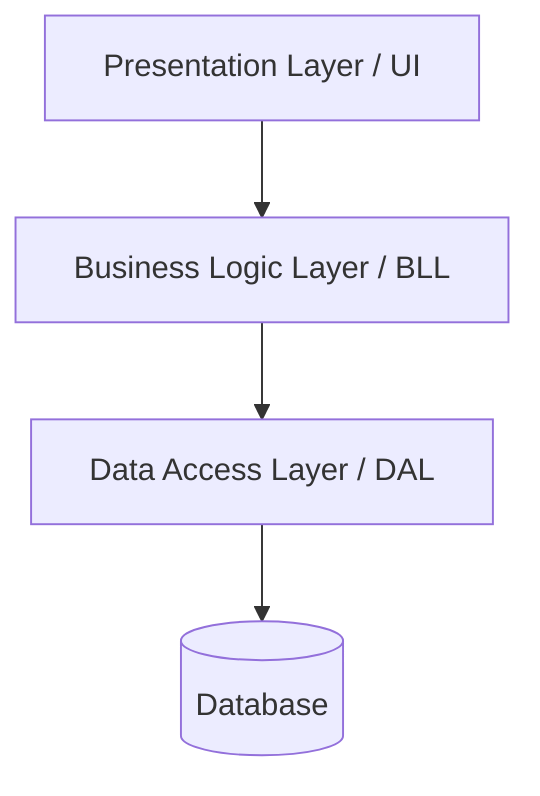

Layered Architecture (also known as n-tier architecture) is one of the most common architectural patterns in software development. It organizes an application into a set of layers, where each layer has a specific role and responsibility. Layers communicate only with adjacent layers, creating a clear separation of concerns.

## How It Works

In a layered architecture, the application is divided into horizontal layers stacked on top of one another. Each layer provides services to the layer above it and consumes services from the layer below it. The classic three-tier example looks like this:

Dependencies flow downward: the UI depends on the business logic layer, which depends on the data access layer.

## Common Layers

The most commonly used layers in a layered architecture are:

- **Presentation Layer (UI)**: Handles user interaction and display. Contains forms, web pages, API controllers, and view models.
- **Business Logic Layer (BLL)**: Contains the core application logic and business rules. Processes data between the UI and the data access layer.
- **Data Access Layer (DAL)**: Manages communication with data stores such as databases. Contains repositories, queries, and data models.

Some applications also include:

- **Application Layer**: Coordinates tasks and delegates work to domain objects. Sits between the UI and the business logic layer, handling use cases and workflows.
- **Service Layer**: Provides a defined API over business logic for use by the presentation layer or external systems.

## Logical Layers vs. Physical Tiers

It is important to distinguish between *logical layers* and *physical tiers*:

- **Logical layers** are conceptual divisions of code responsibility within an application. They represent how code is organized and separated by concern, but may all run within the same process or on the same machine.
- **Physical tiers** refer to the actual deployment of components on separate physical or virtual machines. A tier is an independently deployable unit (e.g., a web server, an application server, a database server).

A three-layer application may be deployed as a two-tier system (e.g., web + database), or as a three-tier system (e.g., web server + app server + database server), or even as a single-tier system (everything on one machine). Layers and tiers do not have to map one-to-one.

## Related Resources

- [N-Tier Architecture](/docs/architecture/n-tier-architecture/)
- [Clean Architecture](/docs/architecture/clean-architecture/)
- [Vertical Slice Architecture](/docs/architecture/vertical-slice-architecture/)
- [Separation of Concerns](/docs/principles/separation-of-concerns/)
