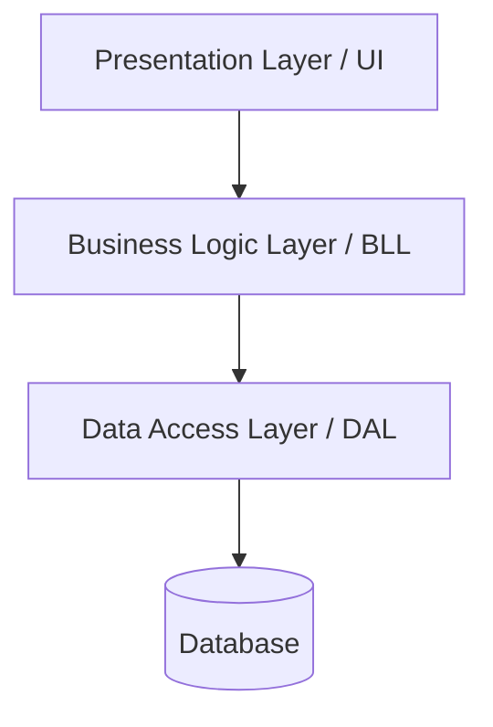

N-Tier Architecture is a well-established approach to organizing software applications into a set of logical layers (tiers), each responsible for a specific concern. It is an example of, and near synonym for, [Layered Architecture](/docs/architecture/layered-architecture/). The "N" in N-Tier refers to the variable number of layers—most commonly three, but sometimes more.

## Logical Layers vs. Physical Tiers

A key distinction in N-Tier Architecture is the difference between *logical layers* and *physical tiers*:

- **Logical layers** are how code is organized within the application. They define which code is responsible for which concern (e.g., user interface, business rules, data access). All logical layers can run within the same process on the same machine.
- **Physical tiers** refer to how the application is *deployed*. Each tier is an independently deployable unit, often running on a separate server or process (e.g., a web server, an application server, and a database server).

A three-layer application may be deployed as a two-tier system (client + server), a three-tier system (web + app + database), or even as a single tier (all on one machine). Layers are a logical concept; tiers are a physical one.

## Common Layers

The most common layers in N-Tier Architecture are:

- **Presentation Layer (UI)**: Handles user interaction and display. This is what the user sees and interacts with—web pages, desktop forms, mobile screens, or API controllers.
- **Business Logic Layer (BLL)**: Contains the application's core rules and logic. It processes requests from the presentation layer and applies domain-specific rules before passing data to or from the data access layer.
- **Data Access Layer (DAL)**: Manages communication with data storage, such as a relational database, file system, or external service. It abstracts the details of data persistence from the rest of the application.

Some architectures include additional layers:

- **Application Layer**: Coordinates high-level use cases and workflows. It sits between the UI and the BLL, orchestrating calls to business logic without containing business rules itself.
- **Service Layer**: Exposes business functionality as a defined API, making it accessible to presentation layers or external systems.

## Benefits

- **[Separation of Concerns](/docs/principles/separation-of-concerns/)**: Each layer has a clear, focused responsibility, making the system easier to understand and reason about.
- **Maintainability**: Changes to one layer (e.g., swapping a database) can often be made without affecting other layers.
- **Reusability**: The BLL can be reused across multiple presentation layers (e.g., a web app and an API).
- **Scalability**: Physical tiers can be scaled independently based on load (e.g., adding more application servers without scaling the database).
- **Testability**: Business logic in the BLL can be tested independently of the UI and database.
- **Familiarity**: N-Tier is one of the most well-known architectural patterns, making it easy to onboard developers.

## Drawbacks

- **Performance overhead**: Passing data through multiple layers introduces latency, especially when layers are on separate physical tiers.
- **Tight coupling between layers**: In naive implementations, upper layers may depend heavily on lower-layer implementation details, making changes difficult.
- **Can lead to an anemic domain model**: Business logic may end up scattered across layers rather than centralized in a rich domain model.
- **Scalability limits**: Strictly horizontal layers do not scale as well as feature-oriented or microservice approaches for large, complex systems.
- **Cross-cutting concerns**: Aspects like logging, caching, and authorization must be handled consistently across all layers, which can be repetitive and error-prone.

## Tradeoffs

N-Tier Architecture is a pragmatic choice for many applications, particularly those with clear separation between UI, logic, and data. It is familiar, well-documented, and supported by most frameworks. However, as systems grow in complexity, teams often find that strict layering can introduce rigidity. Alternative approaches like [Vertical Slice Architecture](/docs/architecture/vertical-slice-architecture/) or [Clean Architecture](/docs/architecture/clean-architecture/) address some of these limitations by organizing code around features or domain models rather than technical concerns. Even these approaches have limits, however, since they don't produce truly modular systems organized around [bounded contexts](https://deviq.com/#). For that, choose the [modular monolith](https://deviq.com/#) or [microservices](https://deviq.com/#) architecture.

## Related Resources

- [Layered Architecture](/docs/architecture/layered-architecture/)
- [Clean Architecture](/docs/architecture/clean-architecture/)
- [Vertical Slice Architecture](/docs/architecture/vertical-slice-architecture/)
- [Separation of Concerns](/docs/principles/separation-of-concerns/)
- [Single Responsibility Principle](/docs/principles/single-responsibility-principle/)
