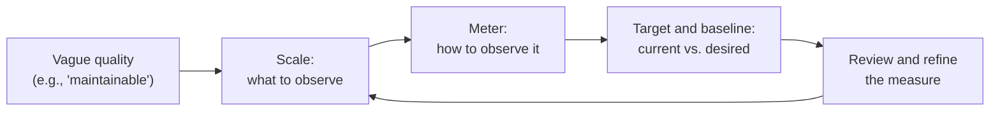

*"Anything you need to quantify can be measured in some way that is superior to not measuring it at all."* — Tom Gilb

Software teams often dismiss the things that matter most — maintainability, usability, developer productivity, code quality — as too subjective to measure. Gilb's Law pushes back on that excuse. It doesn't promise that measurement will be easy, cheap, or precise. It promises only that a thoughtful, imperfect measurement is better than none at all.

## Table of Contents

- [Table of Contents](#table-of-contents)
- [Origin](#origin)
- [The Law Stated](#the-law-stated)
- [What the Law Means for Software Developers](#what-the-law-means-for-software-developers)
- [Example: Measuring Maintainability](#example-measuring-maintainability)
- [Gilb's Trap: The Cost of Measuring Naively](#gilbs-trap-the-cost-of-measuring-naively)
- [Relation to Other Laws and Principles](#relation-to-other-laws-and-principles)
- [Practical Guidance](#practical-guidance)
- [References](#references)

## Origin

**Tom Gilb** is a software engineering consultant and author known for his early and persistent advocacy of quantified requirements and evolutionary delivery. His 1976 book *Software Metrics* was one of the first to treat measurement as a core engineering discipline in software, and he later formalized his approach in *Principles of Software Engineering Management* (1988) and *Competitive Engineering* (2005), which introduced **Planguage**, a notation for specifying quality requirements in measurable terms.

The law became widely known through Tom DeMarco and Timothy Lister's classic *Peopleware: Productive Projects and Teams*. DeMarco and Lister recount Gilb sharing the idea with one of them at a software engineering conference, and they named it **Gilb's Law** as a compact statement of what Gilb called the measurability principle. *Peopleware* uses it to argue that even hard-to-quantify outcomes, such as the productivity of knowledge workers, can and should be measured in some useful way.

## The Law Stated

> Anything you need to quantify can be measured in some way that is superior to not measuring it at all.

Two qualifiers in the wording matter:

- **"Anything you need to quantify"** — the law applies to things you actually need to reason about numerically, not to everything. It is not a mandate to measure for the sake of measuring.
- **"In some way that is superior to not measuring it at all"** — the bar is deliberately low. The measurement can be rough, indirect, or expensive to refine. It only has to beat guessing.

## What the Law Means for Software Developers

Many of the most important qualities of software are described with vague adjectives: *fast*, *reliable*, *secure*, *easy to use*, *maintainable*. Gilb's Law suggests that each of these can be turned into something observable:

- **Performance.** "The page should load quickly" becomes "95% of product pages render in under 800 ms on a mid-range mobile device."
- **Reliability.** "The service should be stable" becomes a service-level objective, such as 99.9% of requests succeeding over a rolling 30-day window.
- **Usability.** "The checkout should be easy" becomes "a first-time user completes checkout in under two minutes without help, in 9 out of 10 usability sessions."
- **Maintainability.** "The code should be easy to change" becomes lead time for a typical change, the number of files touched per feature, or the time a new team member needs to ship their first fix.
- **Security.** "The system should be secure" becomes mean time to patch critical vulnerabilities, or the count of high-severity findings open longer than 14 days.
- **Developer experience.** "Builds are painful" becomes the median CI duration and the percentage of builds that fail for reasons unrelated to the change.

None of these measures captures the whole quality. Each is a proxy. But each gives a team something to discuss, track, and improve, which is far more useful than an argument between two people's intuitions.

The diagram reflects the approach Gilb advocates in Planguage: define a **scale** (what is being measured), a **meter** (how it will be measured), and **baseline** and **target** values. Then revisit the measure as you learn whether it actually tracks what you care about.

## Example: Measuring Maintainability

Suppose a team says its legacy order-processing module is "hard to maintain" and wants to justify time for [refactoring](/practices/refactoring/). Without measurement, the conversation stalls on opinion. Applying Gilb's Law, the team might define:

| Attribute | Value |
| --- | --- |
| Quality | Maintainability of the order-processing module |
| Scale | Working hours from starting a typical small change to merging it |
| Meter | Tracked from the issue tracker for the last 20 changes to the module |
| Baseline | Median of 14 hours |
| Target | Median of 6 hours within two quarters |

The numbers are imperfect. "Typical small change" is fuzzy, and work-hour tracking is noisy. But the team now has a baseline, a goal, and a way to tell whether the refactoring investment paid off. It can also compare the module against others in the codebase to prioritize where to invest next.

## Gilb's Trap: The Cost of Measuring Naively

Glenn Vanderburg coined the term **Gilb's Trap** to describe what happens when the law meets the messiness of real projects. The law itself holds, but applying it carelessly creates new problems:

1. **Measurement has a cost.** Collecting data takes effort. A measure that costs more than the decisions it informs are worth is a net loss, even if it is technically better than nothing.
2. **Measurement changes behavior.** People optimize for what is measured. A team measured on story points delivered will find ways to deliver more story points, which is not the same as delivering more value. This is [Goodhart's Law](/laws/goodharts-law/) in action.
3. **Numbers look more certain than they are.** A rough estimate, once written down as a number, tends to be treated as a precise fact. Error bars and caveats are quickly forgotten.

Gilb's Law says measurement is *possible* and *worthwhile*. Gilb's Trap reminds you to measure thoughtfully, to treat measures as proxies rather than goals, and to be honest about their limits.

## Relation to Other Laws and Principles

- **[Goodhart's Law](/laws/goodharts-law/)** — the essential counterweight. Gilb's Law encourages you to measure. Goodhart's Law warns that once a measure becomes a target, it stops being a good measure. Used together, they suggest measuring widely but tying incentives to any single metric carefully, if at all.
- **[Hofstadter's Law](/laws/hofstadters-law/)** — estimates are measurements of the future, and they are reliably optimistic. Gilb's Law argues that a rough estimate still beats no estimate. Hofstadter's Law reminds you to expect it to be wrong, and to measure actuals so you can calibrate.
- **[Law of Diminishing Returns](/laws/law-of-diminishing-returns/)** — the first, crude measurement of a quality delivers most of the insight. Each additional increment of precision usually costs more and tells you less.
- **[Analysis Paralysis](/antipatterns/analysis-paralysis/)** — the failure mode of trying to design the perfect metric before measuring anything. Gilb's Law says to start with a good-enough measure now and refine it later.

## Practical Guidance

1. **Start with the decision.** Ask what decision the measurement will inform. If no decision depends on it, you probably don't *need* to quantify it, and the law doesn't apply.
2. **Accept rough proxies.** A cheap, indirect measure you actually collect beats a perfect one you never get around to. Survey results, sampled timings, and simple counts are all legitimate.
3. **Make quality requirements measurable.** When a requirement says "fast," "secure," or "user-friendly," ask what observable result would prove it has been met. Write that down as the acceptance criterion.
4. **Establish a baseline before you change anything.** Without a "before" number, you can't show that a refactoring, process change, or new tool made things better.
5. **Use several measures, not one.** Balance speed with quality, and output with outcomes. A small set of complementary measures is much harder to game than a single target.
6. **Revisit your measures.** When a metric stops correlating with the outcome you care about, change or retire it. Measures are tools, not commitments.

## References

1. Gilb, Tom. *Software Metrics*. Winthrop Publishers, 1976.
2. Gilb, Tom. *Principles of Software Engineering Management*. Addison-Wesley, 1988.
3. Gilb, Tom. *Competitive Engineering: A Handbook for Systems Engineering, Requirements Engineering, and Software Engineering Using Planguage*. Butterworth-Heinemann, 2005.
4. DeMarco, Tom, and Timothy Lister. *Peopleware: Productive Projects and Teams*. Dorset House, 1987 (3rd ed. Addison-Wesley, 2013).
5. Vanderburg, Glenn. ["Gilb's Trap."](https://vanderburg.org/blog/2003/02/03/gilbs-trap.html) February 3, 2003.
6. [Goodhart's Law](/laws/goodharts-law/)
7. [Hofstadter's Law](/laws/hofstadters-law/)
