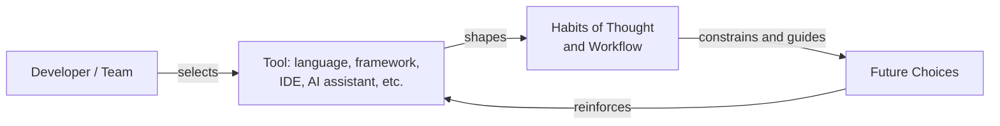

*"We shape our tools and thereafter they shape us."* — commonly attributed to Marshall McLuhan

McLuhan's Law captures a feedback loop familiar to every software developer: the languages, frameworks, and platforms teams adopt to solve problems end up quietly reshaping how those teams think about problems in the first place. A tool chosen for convenience today becomes the lens through which tomorrow's decisions are made.

## Table of Contents

- [Table of Contents](#table-of-contents)
- [Origin](#origin)
- [The Law Stated](#the-law-stated)
- [What the Law Means for Software Developers](#what-the-law-means-for-software-developers)
- [Example: How an ORM Shapes Design Thinking](#example-how-an-orm-shapes-design-thinking)
- [Relation to Other Laws and Principles](#relation-to-other-laws-and-principles)
- [Practical Guidance](#practical-guidance)
- [References](#references)

## Origin

The quotation is almost universally attributed to Canadian media theorist **Marshall McLuhan**, whose 1964 book *Understanding Media: The Extensions of Man* introduced the equally famous phrase "the medium is the message." McLuhan argued that a medium's form — not merely the content it carries — changes how people perceive and behave. A printed book, a telephone, and a television don't just transmit information differently; they train their users to think differently.

The precise sentence "We shape our tools and thereafter they shape us," however, does not appear in McLuhan's own published writing. As Stanford Law School's *Legal Aggregate* blog documents, the line was actually written by **Father John Culkin**, a communications scholar and friend of McLuhan's, in a 1967 *Saturday Review* article titled "A Schoolman's Guide to Marshall McLuhan." Culkin was summarizing and popularizing McLuhan's ideas, and his crisp paraphrase proved so quotable that it was gradually absorbed into the McLuhan canon itself. It is a fitting irony: a statement about how tools reshape their creators has itself been reshaped by decades of retelling, its authorship reassigned to the person it was describing. See the [Stanford Law School write-up](https://law.stanford.edu/2014/09/18/first-build-tools-build-us-marshall-mcluhan/) for the full account.

Whoever coined the exact phrasing, the underlying idea is authentically McLuhan's: media and tools are not neutral conduits. They actively restructure the habits, expectations, and cognitive patterns of the people who use them.

## The Law Stated

> We shape our tools and thereafter they shape us.

Applied to software development, McLuhan's Law says that the tools a developer or team adopts — a programming language, an IDE, a framework, a version control workflow — don't just execute the team's intentions. Over time, they become the mental model the team reasons in. The tool stops being something developers use and becomes something that shapes what they can imagine building.

## What the Law Means for Software Developers

Every layer of the modern development stack nudges the people using it toward particular habits of thought:

- **Programming languages.** A language's type system, syntax, and idioms shape how developers decompose problems. Developers who learn functional programming first tend to reach for immutability and composition; developers steeped in an object-oriented language reach for hierarchies and encapsulation. The language doesn't just express the solution — it suggests which solutions are thinkable.
- **Frameworks.** A framework's "golden path" — the workflow it makes easiest — becomes the default architecture for everything built with it, whether or not it's the best fit. Convention-over-configuration frameworks like ASP.NET Core Minimal APIs or Ruby on Rails actively discourage deviation, which is efficient when the convention fits and constraining when it doesn't.
- **IDEs and editors.** Autocomplete, inline diagnostics, and refactoring tools change what feels effortless versus effortful. A developer working in an IDE with powerful "extract method" support refactors more often than one working in a plain text editor — not because they're more disciplined, but because the tool lowered the cost of the action.
- **ORMs.** Object-relational mappers shape how developers model data, often encouraging an object-graph mindset that fights against how relational databases actually perform. See the worked example below.
- **Source control and branching models.** Git's cheap, local branching made feature branches and pull request review the default collaboration pattern for an entire generation of developers — a workflow that would have been impractical under centralized systems like early CVS or Subversion. The tool didn't just support the practice; it made the practice imaginable.
- **CI/CD pipelines.** A build pipeline that runs tests in ninety seconds encourages small, frequent commits and a tight feedback loop. A pipeline that takes ninety minutes trains developers to batch changes, delay integration, and dread the build — the tool shapes the team's relationship with change itself.
- **Issue trackers.** The fields and workflows a tracker exposes — story points, priority levels, swimlanes — become the vocabulary a team uses to think about its own work. A tracker that only models "bugs" and "features" makes it harder for a team to talk about technical debt as a first-class concern.
- **AI coding assistants.** Tools that autocomplete entire functions change not just typing speed but design judgment. Developers who lean on an assistant's suggestions may drift toward whatever patterns the model was trained to produce most confidently, and may exercise less of the deliberate, exploratory thinking that produces novel designs. The assistant becomes a collaborator whose habits of mind blend with the developer's own — for better and for worse.
- **Architecture choices.** Once a team commits to microservices, message queues, or a specific cloud provider's managed services, those choices become the frame through which every subsequent design conversation happens. "How would we do this in a monolith?" stops being an easy question to ask, let alone answer.



The diagram illustrates the feedback loop at the heart of McLuhan's Law: a tool chosen for one project doesn't stay contained to that project. It shapes the habits developers bring to the next decision, which in turn reinforces reliance on the same category of tool.

## Example: How an ORM Shapes Design Thinking

A concrete illustration of a tool shaping design is how an ORM's idioms push developers toward navigating object graphs even when a direct query would be simpler and faster. Consider a request to fetch an order total.

```csharp
// Shaped by the ORM: the tool makes navigating object graphs feel natural,
// so the developer reaches for it even when it isn't the best fit.
public decimal GetOrderTotal(int orderId)
{
    // EF Core's fluent, LINQ-to-Objects-like API encourages loading
    // the entire aggregate and computing in memory.
    var order = _dbContext.Orders
        .Include(o => o.LineItems)
        .First(o => o.Id == orderId);

    return order.LineItems.Sum(li => li.Quantity * li.UnitPrice);
}
```

```csharp
// The alternative: a developer who reaches for a query-shaped tool (e.g., Dapper,
// or EF Core's projection support) is nudged toward asking the database
// to do the arithmetic, shifting the design toward set-based thinking.
public decimal GetOrderTotal(int orderId)
{
    return _dbContext.Orders
        .Where(o => o.Id == orderId)
        .SelectMany(o => o.LineItems)
        .Sum(li => li.Quantity * li.UnitPrice);
}
```

Neither version is "wrong," and both are valid uses of EF Core. The point is that the first version is the one an ORM's object-graph-navigation idioms make easiest to reach for — it feels natural because the tool was built to make it feel natural. A developer who has spent years working directly against SQL, by contrast, tends to reach for the second shape instinctively, because a different tool trained a different instinct. The tool doesn't just implement the design; it predisposes the designer.

## Relation to Other Laws and Principles

McLuhan's Law sits alongside several other observations about how structure and tooling constrain thought and design:

- **[Conway's Law](/laws/conways-law/)** — describes the same shaping effect at the organizational level: the communication structure of a team constrains the architecture it produces. McLuhan's Law is the individual and team-habit-level analog — tools shape thought the way org charts shape system boundaries. Read together, they suggest that both the people-structures and the tool-structures a team operates within leave fingerprints on the resulting software.
- **[Golden Hammer](/antipatterns/golden-hammer/)** — the antipattern that results when McLuhan's Law goes unchecked: a developer grows so shaped by a familiar tool that they apply it to every problem, whether or not it fits. "If all you have is a hammer, everything looks like a nail" is McLuhan's Law's cautionary endpoint.
- **[Wirth's Law](/laws/wirths-law/)** — observes that software tends to grow slower even as hardware grows faster, often because the abstractions and frameworks developers are shaped to reach for prioritize developer convenience over runtime efficiency. The tools that make developers productive can be the same tools that make the resulting software slow.
- **The Sapir-Whorf hypothesis** — a linguistics theory proposing that the structure of a language shapes (or even limits) the thoughts its speakers can have. McLuhan's Law is often described as the software-tooling equivalent: the "language" a developer thinks in isn't only a spoken language but also a programming language, framework, or IDE.

## Practical Guidance

McLuhan's Law is not an argument against adopting tools — it's an argument for adopting them deliberately, with eyes open to their second-order effects:

1. **Audit your defaults periodically.** Ask why the team reaches for a particular language, framework, or pattern by default. If the honest answer is "it's what we already know," that's worth examining, not necessarily abandoning.
2. **Rotate tools and perspectives.** Occasionally solving a familiar problem in an unfamiliar language or paradigm reveals habits of thought that had become invisible. This is one reason polyglot programming and cross-team rotation have lasting value beyond the immediate task.
3. **Choose tools for the problem, not the other way around.** Recognize the moment when a team is reshaping a problem to fit a beloved tool rather than the reverse — a hallmark of the [Golden Hammer](/antipatterns/golden-hammer/) antipattern.
4. **Treat AI coding assistants as shaping influences, not neutral tools.** Review AI-suggested code with the same scrutiny given to a junior teammate's pull request, and stay deliberate about which suggestions to internalize as habit versus accept once and move past.
5. **Design tools and processes with their shaping effect in mind.** When building internal tooling, CI pipelines, or issue-tracker workflows, remember that whatever is made easy will be done often, and whatever is made hard will quietly disappear from the team's practice — regardless of its actual value.

## References

1. McLuhan, Marshall. *Understanding Media: The Extensions of Man.* McGraw-Hill, 1964.
2. Culkin, John M. "A Schoolman's Guide to Marshall McLuhan." *Saturday Review*, March 18, 1967.
3. ["First, We Build the Tools, Then They Build Us: The Story Behind a Marshall McLuhan Quote."](https://law.stanford.edu/2014/09/18/first-build-tools-build-us-marshall-mcluhan/) Stanford Law School, *The Legal Aggregate*, September 18, 2014.
4. [Conway's Law](/laws/conways-law/)
5. [Golden Hammer](/antipatterns/golden-hammer/)
6. [Wirth's Law](/laws/wirths-law/)
