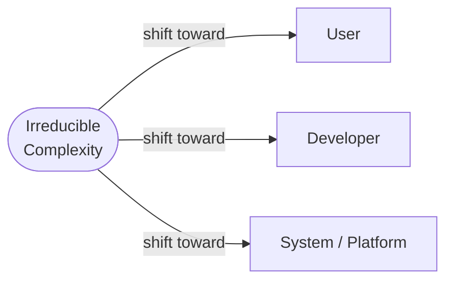

*"Every application has an inherent amount of irreducible complexity. The only question is who will have to deal with it — the user, the developer, or the system."* — Larry Tesler

Tesler's Law, also known as the **Law of Conservation of Complexity**, is a principle from human–computer interaction (HCI) that captures a fundamental constraint on software design: complexity is conserved, not eliminated. You can move complexity from one place to another, but you cannot make it disappear.

## Table of Contents

- [Table of Contents](#table-of-contents)
- [Origin](#origin)
- [The Law Stated](#the-law-stated)
- [What the Law Means](#what-the-law-means)
- [Where Complexity Lives](#where-complexity-lives)
- [Example: The Print Dialog](#example-the-print-dialog)
- [Tesler's Law in Software Development](#teslers-law-in-software-development)
- [Strategies for Managing Complexity](#strategies-for-managing-complexity)
- [Relation to Other Principles](#relation-to-other-principles)
- [References](#references)

## Origin

Larry Tesler was a pioneering computer scientist best known for inventing cut, copy, and paste — one of the most consequential UX decisions in computing history. He spent years at Xerox PARC during its golden era of innovation and later joined Apple, where he played a central role in shaping the Macintosh's user interface philosophy.

Tesler's focus throughout his career was on making computers easier for ordinary people to use. His law grew out of that work: the belief that a designer's job is not to wish complexity away, but to make deliberate choices about who bears it.

## The Law Stated

> Every application has an inherent amount of irreducible complexity. The only question is who will have to deal with it — the user, the developer, or the system.

The word *irreducible* is key. Some complexity is accidental — it arises from poor design choices, unclear requirements, or unnecessary abstractions, and it can be removed. But some complexity is inherent to the problem domain itself. No amount of clever design eliminates it. It can only be redistributed.

## What the Law Means

Think of complexity as a fixed volume of liquid in a closed container. Squeeze it down in one place and it bulges out somewhere else. The total volume does not change.

In practice, this means every design decision that reduces complexity for one stakeholder increases it for another:

- **Hide configuration behind smart defaults** — the user experience becomes simpler, but the developer must write and maintain more logic to determine what "smart" means in each context.
- **Expose a rich set of options** — the developer's code stays lean, but the user must now read documentation, understand trade-offs, and make decisions they may not be equipped to make.
- **Delegate decisions to the system or infrastructure** — both the user and the developer get a simpler interface, but the underlying platform or algorithm must encode and execute the reasoning that was removed from the surface.

The diagram above illustrates that complexity flows between stakeholders — it does not vanish. A design decision is, at its core, a choice about where in this triangle the burden lands.

## Where Complexity Lives

Tesler's Law identifies three destinations for complexity:

| Destination | What it looks like |
|---|---|
| **User** | Long setup wizards, dense option dialogs, manual configuration steps, error messages that require domain knowledge to interpret |
| **Developer** | Business logic encoding user intent, conditional branches for edge cases, translation layers between domain models and UI models |
| **System / Platform** | Intelligent defaults, auto-configuration, convention-over-configuration frameworks, AI-assisted decision making |

None of these is universally the right answer. The appropriate location depends on who is best equipped to handle that complexity — and at what cost.

## Example: The Print Dialog

Printing is a classic illustration of Tesler's Law in action.

**Scenario 1 — The system decides everything.** The application automatically selects paper size, orientation, and color mode based on the document content. The user clicks Print and the job is done. Complexity lives in the system: the algorithm must make correct inferences, handle edge cases, and behave predictably when the document content is ambiguous.

**Scenario 2 — The user decides everything.** The print dialog exposes 20 distinct settings: paper size, custom margins, duplex mode, color profile, tray selection, print quality, and more. The user carries the complexity: they must understand what each option means and how choices interact with one another.

**Scenario 3 — The developer balances both.** The application ships with sensible defaults but provides an "Advanced" panel for users who need control. The developer carries the complexity: they must determine which defaults are actually sensible, write the logic that applies them, and build a UI that exposes advanced options without overwhelming users who never need them.

Each scenario is a valid design choice. The trade-off is explicit: shift complexity to the system and you take on engineering risk; shift it to the user and you take on UX risk.

## Tesler's Law in Software Development

Tesler's Law shows up constantly in day-to-day software decisions, even when teams do not name it:

- **Configuration vs. convention** — Frameworks like Ruby on Rails or ASP.NET Core's minimal API embrace convention-over-configuration, deliberately moving complexity from developer configuration files into the framework itself.
- **Abstraction layers** — Adding an abstraction simplifies the caller's code but adds a layer that must be understood, tested, and maintained by the developer building or consuming it.
- **Wizard-driven UIs vs. expert UIs** — A setup wizard guides new users step by step (system and developer absorb complexity) at the cost of flexibility that experienced users may need (pushing complexity back to the user through workarounds).
- **AI-assisted tooling** — Code generation tools shift complexity from the developer writing boilerplate to the model and the infrastructure running it — but introduce new complexity around correctness, review, and trust.

Understanding that these trade-offs exist — and that they are trade-offs, not free wins — leads to more deliberate design decisions.

## Strategies for Managing Complexity

Tesler's Law does not tell you where to put complexity; it tells you that you must put it somewhere. Some guiding principles for making that choice well:

1. **Put complexity where it can be managed best.** A developer has tools — tests, type systems, refactoring — that a user does not. If a decision is technical and high-stakes, the developer is often better positioned to absorb it than the user is.
2. **Be explicit about trade-offs.** When a design review proposes simplifying the user interface, ask: where is the complexity going? If the answer is "into the codebase," that is a conscious choice — budget for it.
3. **Apply [Gall's Law](../galls-law/) incrementally.** Start with the simplest design and add complexity only where demand is proven. This avoids front-loading developer and system complexity for features users may never need.
4. **Distinguish accidental from essential complexity.** [Essential complexity](https://en.wikipedia.org/wiki/No_Silver_Bullet) is inherent to the problem; accidental complexity is introduced by implementation choices. Tesler's Law applies only to essential complexity — accidental complexity can and should be removed outright.
5. **Design for the right user.** A developer tool can reasonably expose more complexity than a consumer app, because the user's baseline knowledge is higher. Know your audience when deciding where the burden lands.

## Relation to Other Principles

Tesler's Law intersects with several other principles in software design:

- **[No Silver Bullet](https://en.wikipedia.org/wiki/No_Silver_Bullet)** (Fred Brooks) — distinguishes essential from accidental complexity, providing a useful companion framework for understanding which complexity Tesler's Law applies to.
- **[Gall's Law](../galls-law/)** — advises starting simple and evolving incrementally, which aligns with deferring developer and system complexity until it is genuinely needed.
- **[Conway's Law](../conways-law/)** — organizational structure shapes architecture; the team that "owns" a complexity will influence how and where it manifests in the system.
- **KISS (Keep It Simple, Stupid)** — a design heuristic that encourages reducing accidental complexity, not a refutation of Tesler's Law.
- **[YAGNI (You Aren't Gonna Need It)](/principles/yagni/)** — avoids prematurely absorbing developer and system complexity for features that may never be required.

## References

1. Tesler, Larry. [Computers Ltd: What They Really Can't Do](https://en.wikipedia.org/wiki/Larry_Tesler) — Oxford University Press, 2000.
2. Cooper, Alan. [The Inmates Are Running the Asylum](https://amzn.to/3OoUEsh) — Sams Publishing, 1999. (Popularized Tesler's Law for UX audiences.)
3. Brooks, Frederick P. ["No Silver Bullet — Essence and Accident in Software Engineering."](http://www.cs.nott.ac.uk/~pszcah/G51ISS/Documents/NoSilverBullet.html) IEEE Computer, April 1987.
4. [Larry Tesler — Wikipedia](https://en.wikipedia.org/wiki/Larry_Tesler)
5. [Law of Conservation of Complexity — Interaction Design Foundation](https://www.interaction-design.org/literature/topics/teslers-law)
