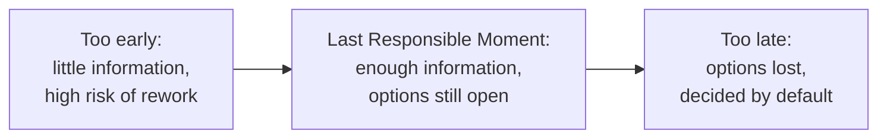

Delay Commitment is one of the seven principles of [Lean Software Development](/principles/#lean-software-development). (The Poppendiecks' first book called it *Decide as Late as Possible*.) It advises that decisions, especially those that are difficult or expensive to reverse, should be made at the **Last Responsible Moment**: the point at which failing to decide would eliminate an important option.

## The Last Responsible Moment

Decisions made early are made with the least information. Requirements change, users discover what they actually need, and technical constraints become clear only as the system takes shape. Committing early to a database, a framework, or a detailed design means accepting the risk that the commitment will turn out to be wrong, and that undoing it will be expensive.

The Last Responsible Moment is *not* the last possible moment. Waiting too long is its own failure: the option disappears, or the decision gets made by default. The goal is to keep options open as long as doing so is cheaper than closing them, and then to decide deliberately.

## Delay Commitment Is Not Procrastination

Delaying commitment does not mean doing nothing. While a decision is deferred, the team should be actively [learning](/principles/amplify-learning/) about it: building spikes, exploring alternatives, and gathering feedback. Nor does it mean avoiding all decisions; reversible decisions can and should be made quickly. Delaying commitment also doesn't justify [analysis paralysis](/antipatterns/analysis-paralysis/), which is the failure to decide even when the moment has arrived.

## Keeping Options Open

Delaying commitment is only possible in a system designed to tolerate change. Several principles and practices make this easier:

- [Dependency Inversion](/principles/dependency-inversion-principle/) and [Persistence Ignorance](/principles/persistence-ignorance/) let a team defer infrastructure choices, such as which database to use, until they're needed.
- [Architectural Agility](/principles/architectural-agility/) keeps the architecture able to evolve as understanding improves.
- [YAGNI](/principles/yagni/) avoids committing to features and abstractions before they're needed.
- [Separation of Concerns](/principles/separation-of-concerns/) limits the blast radius of a decision that later needs to change.
- [Big Design Up Front](/antipatterns/big-design-up-front/) is the antipattern this principle most directly opposes.

## Related Lean Principles

- [Amplify Learning](/principles/amplify-learning/) - the time gained by delaying commitment should be spent learning.
- [Deliver Fast](/principles/deliver-fast/) - teams that can deliver quickly can afford to decide later.
- [Eliminate Waste](/principles/eliminate-waste/) - work built on premature decisions often becomes waste.

## References

- [Lean Software Development: An Agile Toolkit](https://amzn.to/40GF3fU)
- [Implementing Lean Software Development: From Concept to Cash](https://www.amazon.com/dp/0321437381)
- [The Last Responsible Moment (Coding Horror)](https://blog.codinghorror.com/the-last-responsible-moment/)
