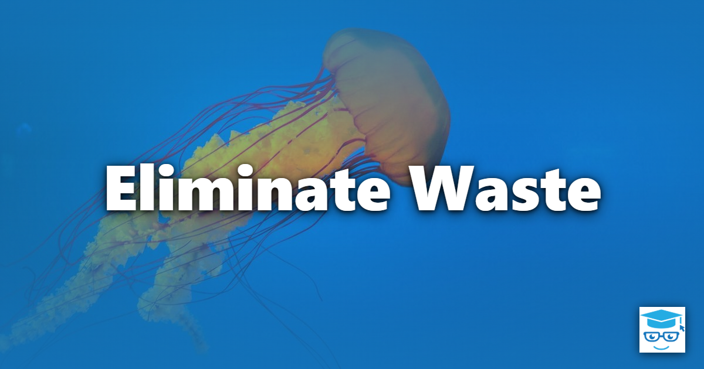

Eliminate Waste is the first of the seven principles of [Lean Software Development](/principles/#lean-software-development), described by Mary and Tom Poppendieck in their book [Lean Software Development: An Agile Toolkit](https://amzn.to/40GF3fU). The principle is adapted from the Toyota Production System, where *muda* (waste) is anything that consumes resources without adding value from the customer's perspective.

In software, waste is anything that doesn't help deliver working, valuable software to the people who will use it. The first step toward eliminating waste is learning to see it.

## The Seven Wastes of Software Development

The Poppendiecks translated the seven wastes of manufacturing into software terms:

| Manufacturing | Software Development | Examples |
| --- | --- | --- |
| Inventory | Partially done work | Unmerged branches, untested code, undeployed features, unimplemented specs |
| Overproduction | Extra features | [Feature creep](/antipatterns/feature-creep/), speculative generality, gold plating |
| Extra processing | Relearning | Rediscovering knowledge that wasn't captured or shared |
| Transportation | Handoffs | Passing work between analysts, developers, testers, and operations |
| Motion | Task switching | Developers juggling several projects or constant interruptions |
| Waiting | Delays | Waiting on approvals, environments, code reviews, or answers to questions |
| Defects | Defects | Bugs found late, rework, production incidents |

## Seeing Waste

Waste is often invisible because it has become part of "how we do things." A few techniques help surface it:

- **Value stream mapping**: trace a single feature from request to production and record how much time is spent actively working versus waiting. The ratio is frequently shocking.
- **Ask "who is this for?"**: every artifact, meeting, and approval step should have a customer, even if that customer is the team itself. If nobody uses it, stop producing it.
- **Watch work in progress**: large amounts of partially done work are a sign that work is being started faster than it's being finished.

## Eliminating Waste in Practice

- Follow [YAGNI](/principles/yagni/) to avoid building features nobody has asked for yet.
- Keep work small and integrate it often with [Continuous Integration](/practices/continuous-integration/) so that partially done work doesn't accumulate.
- Reduce handoffs by organizing around a [Whole Team](/practices/whole-team/) that can take a feature from idea to production.
- Limit work in progress so developers aren't constantly switching between tasks.
- Prevent defects rather than finding them later (see [Build in Quality](/principles/build-in-quality/)).

Be careful not to label everything that isn't writing code as waste. Planning, testing, documentation, and learning all add value when they are done to the degree they're needed. The goal is to remove activities that don't contribute to value, not to strip a process down to its bare minimum. As Steve Smith puts it, [beyond good enough is waste](https://ardalis.com/beyond-good-enough-is-waste/).

## Related Lean Principles

- [Build in Quality](/principles/build-in-quality/) - defects are one of the most expensive forms of waste.
- [Deliver Fast](/principles/deliver-fast/) - shorter cycle times leave less room for partially done work to pile up.
- [Optimize the Whole](/principles/optimize-the-whole/) - removing waste locally can create more of it elsewhere.

## References

- [Lean Software Development: An Agile Toolkit](https://amzn.to/40GF3fU)
- [Implementing Lean Software Development: From Concept to Cash](https://www.amazon.com/dp/0321437381)
- [Beyond Good Enough is Waste](https://ardalis.com/beyond-good-enough-is-waste/)
