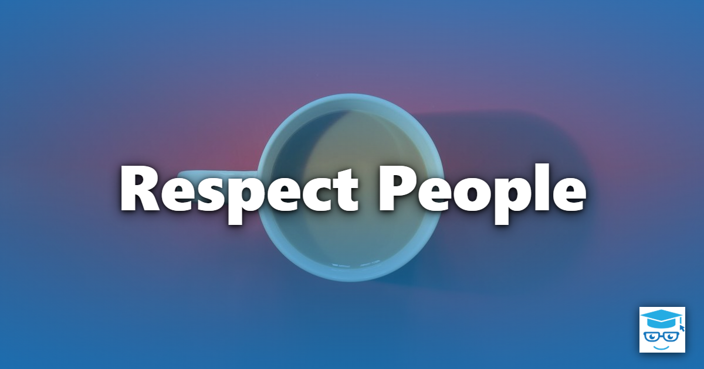

Respect People is one of the seven principles of [Lean Software Development](/principles/#lean-software-development). (The Poppendiecks' first book called it *Empower the Team*.) It recognizes that the people doing the work understand it best, and that the most effective way to improve a process is to give those people the authority, information, and support to improve it themselves.

## Respect Is More Than Politeness

In Lean, respect for people is a practical principle, not just a courtesy. It is one of the two pillars of the Toyota Way, alongside continuous improvement. Respecting people means:

- **Trusting the team to make decisions** about how to do their work, rather than prescribing every detail from above.
- **Sharing information openly**, so teams understand the goals and constraints they're working within. Keeping teams in the dark is its own antipattern: [Mushroom Management](/antipatterns/mushroom-management/).
- **Challenging people to grow**, by giving them meaningful problems and the support to solve them.
- **Maintaining a sustainable pace**, rather than burning people out on a [Death March](/antipatterns/death-march/).

## Empowered Teams

Lean organizations push decisions down to the people closest to the work. A self-organizing [Whole Team](/practices/whole-team/) with the skills to take a feature from idea to production can make decisions quickly, without waiting on approvals or handing work off to other groups. Practices such as [Collective Code Ownership](/practices/collective-code-ownership/) and [Pair Programming](/practices/pair-programming/) spread knowledge across the team, so that it isn't dependent on a few individuals (see [Bus Factor](/terms/bus-factor/)).

Empowerment doesn't mean an absence of leadership. Leaders provide vision, remove obstacles, and ensure the team has the expertise and resources it needs. What they avoid is micromanagement.

## Respect and the Other Lean Principles

The other six Lean principles all depend on this one. Waste is best identified by the people who experience it. Quality is built in by developers who care about their craft and are given time to practice it. Learning requires an environment where it's safe to experiment and to admit mistakes. Respect for people is also one of the core [values](/values/) of extreme programming; see [Respect](/values/respect/).

## Related Lean Principles

- [Optimize the Whole](/principles/optimize-the-whole/) - blaming individuals for system problems is a failure of both respect and systems thinking.
- [Amplify Learning](/principles/amplify-learning/) - learning thrives where people feel safe to experiment.
- [Build in Quality](/principles/build-in-quality/) - empowered teams can stop and fix problems when they find them.

## References

- [Lean Software Development: An Agile Toolkit](https://amzn.to/40GF3fU)
- [Implementing Lean Software Development: From Concept to Cash](https://www.amazon.com/dp/0321437381)
